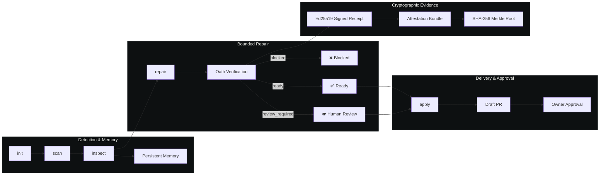

# Software Oath

[](https://github.com/sariserhan/softwareoath/actions/workflows/ci.yml) [](package.json) [](.)

**Software that keeps its promises.**

Software Oath is an autonomous repository steward with an evidence and approval
layer. It periodically understands a repository, remembers what it learned,
detects maintenance problems, prepares bounded repairs, opens draft pull
requests, monitors CI, and waits for the repository owner. An application
declares the rules it must always preserve in `software-oath.yml`.

---

## Architecture



---

## Quick Start

```bash
# 1. Install dependencies
npm install

# 2. Link the CLI globally
npm link

# 3. Start the dashboard
npm run dev
```

Open the URL printed by Vite, normally `http://localhost:5173`.

---

## CLI Reference

| Command | Description | Example |
|:--------|:------------|:--------|
| `init` | Discover validation commands and write a draft `software-oath.yml` | `software-oath init /path/to/repo` |
| `inspect` | Find deterministic problems and run oath checks | `software-oath inspect /path/to/repo` |
| `scan` | Refresh repository persistent stewardship memory | `software-oath scan /path/to/repo` |
| `check` | Execute declared evidence and write a signed receipt | `software-oath check /path/to/repo` |
| `repair` | Repair one selected problem in a disposable worktree | `software-oath repair /path/to/repo` |
| `review` | Show a repair's evidence and complete patch | `software-oath review /path/to/repo latest` |
| `apply` | Apply a verified patch to a new uncommitted branch | `software-oath apply /path/to/repo latest` |
| `autopilot` | Full loop: detect → select → repair → verify → export | `software-oath autopilot /path/to/repo` |
| `replay` | Reproduce and benchmark a historical incident repair | `software-oath replay /path/to/repo incident.yml` |
| `replay-suite` | Benchmark multiple historical incidents | `software-oath replay-suite suite.yml` |
| `serve` | Start the stewardship, repository, and approval API server | `software-oath serve` |
| `worker` | Process durable background repair jobs | `software-oath worker` |
| `migrate` | Apply pending PostgreSQL database migrations | `software-oath migrate` |
| `export-attestations` | Export cryptographic evidence & attestation bundle | `software-oath export-attestations` |
| `verify-bundle` | Verify Merkle root & signature of an attestation bundle | `software-oath verify-bundle bundle.json` |
| `verify-attestation` | Verify a signed final owner-decision attestation | `software-oath verify-attestation final-attestation.json` |
| `github-manifest` | Print least-privilege GitHub App manifest | `software-oath github-manifest` |
| `github-convert` | Encrypt a GitHub App manifest conversion | `software-oath github-convert` |

All commands accept `--json` for machine-readable output. Critical and high findings exit with status `1`.

---

## What Works Today

- **Versioned `software-oath.yml` format** — strict parsing and validation of application rules.
- **Deterministic evaluation** of repair evidence (outputs: `blocked`, `review_required`, `ready`).
- **Ed25519 signed receipts** — verified before review, application, delivery, or approval.
- **Infracost policy gates** — compare baseline and proposed IaC cost, preserve raw-output digests, and block owner-defined overruns.
- **Polyglot dependency stewardship** — npm, pnpm, Yarn, Bun, Python (`pyproject.toml`, `requirements.txt`), Rust (`Cargo.toml`).
- **Incident replay benchmarks** — `replay` and `replay-suite` commands for regression testing.
- **GitHub App integration** — draft PR delivery with split read/write permission pipeline.
- **Control plane API** — `serve` with PostgreSQL-backed background worker.
- **Interactive React dashboard** — Incidents, Runs, Replays, Knowledge, Questions, and Analytics views.
- **Cryptographic attestation bundles** — SHA-256 Merkle root export signed with Ed25519.
- **GitHub Actions workflow** — split-permission template for CI/CD.

---

## Dashboard Views

| View | Description |
|:-----|:------------|
| **Incidents** | Active incident detail with lifecycle stages, evidence panel, and constitution rail |
| **Analytics** | Historical trend charts: repair success rate, MTTR, finding frequency, decision distribution |
| **Runs** | Durable stewardship run history with approval status and evidence |
| **Replays** | Incident replay workspace for benchmarking historical repairs |
| **Knowledge** | Repository intelligence with owner-confirmed knowledge and business promises |
| **Questions** | Owner-facing questions about business purpose, critical journeys, and invariants |

---

## Historical Incident Replay

`software-oath replay <repository> <incident.yml>` checks out the declared buggy
commit in a disposable worktree, confirms its selected finding, runs the bounded
repair, and compares the resulting patch with the original human fix.

`software-oath replay-suite <suite.yml>` runs multiple historical incidents and
calculates aggregate pass rate, scope compliance, and latency metrics.

Pass `--docker-image <trusted-image>` to execute oath commands inside an
ephemeral container with no network, dropped capabilities, resource limits, and
`no-new-privileges`.

---

## GitHub Action

The reusable action in [`action.yml`](action.yml) follows a split-permission model:

1. A **read-only job** runs inspection and the official `openai/codex-action`.
2. Software Oath **rejects out-of-scope edits** and uploads the patch and receipt.
3. A **separate job with write permission** downloads only that artifact, verifies the Ed25519 signature, and opens a pull request.

Copy [`.github/workflows/software-oath.yml`](.github/workflows/software-oath.yml) into the
customer repository, add an `OPENAI_API_KEY` repository secret, and configure
`SOFTWARE_OATH_RECEIPT_PRIVATE_KEY` and `SOFTWARE_OATH_RECEIPT_PUBLIC_KEYS`.

---

## Connected Control Plane

Copy `.env.example`, configure GitHub plus the operator/session secrets, then run
`npm run serve` beside `npm run dev`.

```bash
npm run migrate   # Apply PostgreSQL migrations
npm run worker    # Start durable background repair worker
npm run serve     # Start API server
```

Key endpoints:

| Endpoint | Method | Description |
|:---------|:-------|:------------|
| `/api/repositories` | `POST` | Register a repository and owner-controlled schedule |
| `/api/repositories/:owner/:repo/scan` | `POST` | Start an owner-authorized manual scan |
| `/api/runs` | `GET` | Return durable run history |
| `/api/runs/:id/review` | `GET` | Return permission-checked incident, verified receipt, full patch, evidence, logs, and final attestation |
| `/api/runs/:id/decision` | `POST` | Record an identified decision and written reason |
| `/api/runs/:id/receipt` | `GET` | Verify and return the signed final owner-decision attestation |
| `/api/replays` | `GET` | Return published historical replay reports and summary |
| `/webhooks/sentry` | `POST` | Optional signed Sentry event ingestion |

---

## Constitution Example

```yaml
version: 1

application:
  name: Acme Storefront
  repository: acme/storefront
  defaultBranch: main

approval:
  requireHumanFor: [critical]
  allowAutomaticMerge: false

cost:
  enabled: true
  requireEstimate: true
  currency: USD
  maxMonthlyIncrease: 50
  maxPercentageIncrease: 10

rules:
  - id: payments.no_duplicate_charge
    title: No duplicate charges
    description: A customer payment may be captured at most once per order.
    severity: critical
    repair:
      allowedPaths:
        - src/payments
        - tests/payments
      automaticCandidate: false
    evidence:
      - kind: test
        command: npm run test:checkout-regression
        required: true
        timeoutMs: 120000
```

The command can be any toolchain: `cargo test`, `go test ./...`, `pytest`,
`dotnet test`, `mvn test`, or a repository-owned script.

The complete example is at [`examples/storefront/software-oath.yml`](examples/storefront/software-oath.yml).
The machine-readable schema is [`schemas/software-oath.schema.json`](schemas/software-oath.schema.json).

---

## Product Boundary

Software Oath is **not another coding assistant**. Coding agents may propose a
repair, but Software Oath owns the acceptance decision:

```
Incident → Reproduction → Proposed repair → Oath evaluation
                                              ↓
                            Block / Human review / Ready
```

---

## Development

```bash
npm run lint       # Run ESLint
npm run test:run   # Run all tests (Vitest)
npm run build      # TypeScript + Vite production build
npm run oath:check # Run local constitution evaluator
```

Requirements:
- Node.js 20.19+ or 22.12+
- npm

---

## Contributing

1. Fork the repository and create a feature branch.
2. Run `npm install` and ensure `npm run test:run` passes.
3. Make your changes with tests covering new behavior.
4. Run `npm run lint && npm run test:run && npm run build` before submitting.
5. Open a pull request with a clear description of the change.

---

## Documentation

- [Product Contract](docs/PRODUCT_CONTRACT.md) — durable product direction
- [Product Roadmap](docs/ROADMAP.md) — ordered milestones and release gates
- [Dependency Optimizer Roadmap](docs/DEPENDENCY_OPTIMIZER_ROADMAP.md) — from
  read-only SaaS recommendations to verified Software Oath migrations
- [How It Works](docs/HOW_IT_WORKS.md) — complete repository-to-draft-PR walkthrough
- [Architecture](docs/ARCHITECTURE.md) — target system architecture
- [Deployment](docs/DEPLOYMENT.md) — Docker Compose, GitHub App onboarding, production hosting
- [Runner Security](docs/RUNNER_SECURITY.md) — isolated execution contract and production requirements
- [Production Setup](docs/PRODUCTION_SETUP.md) — canonical topology for the owned domain
- [MVP](docs/MVP.md) — first connected product milestone
